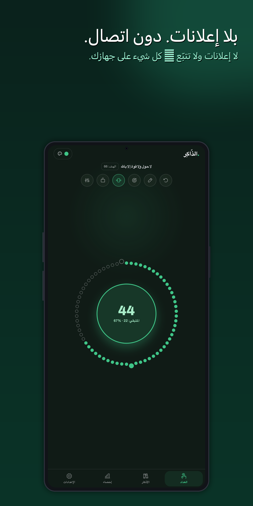
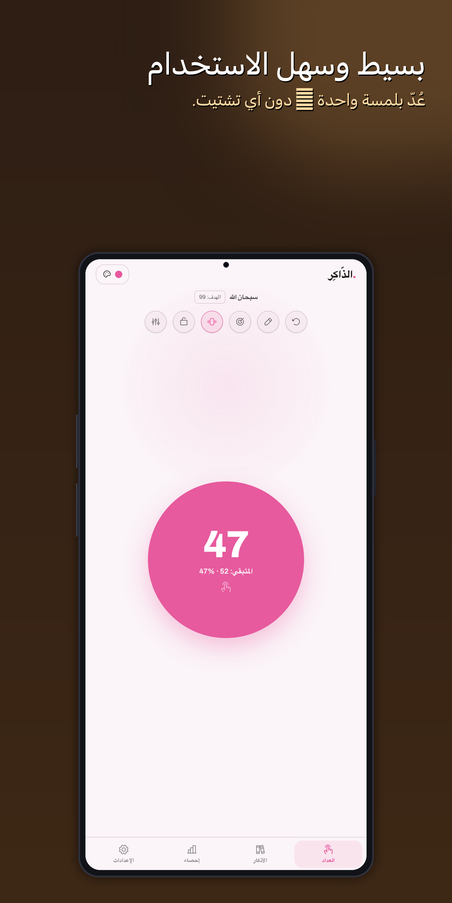
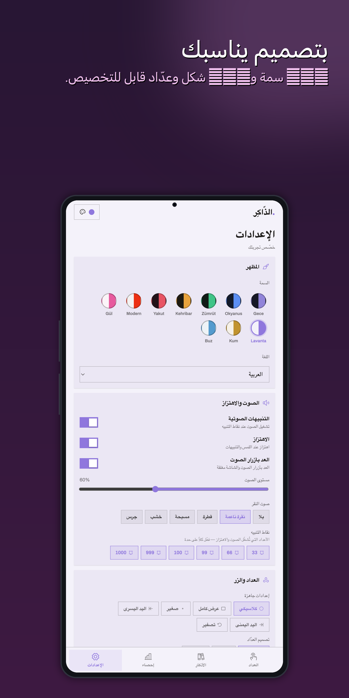
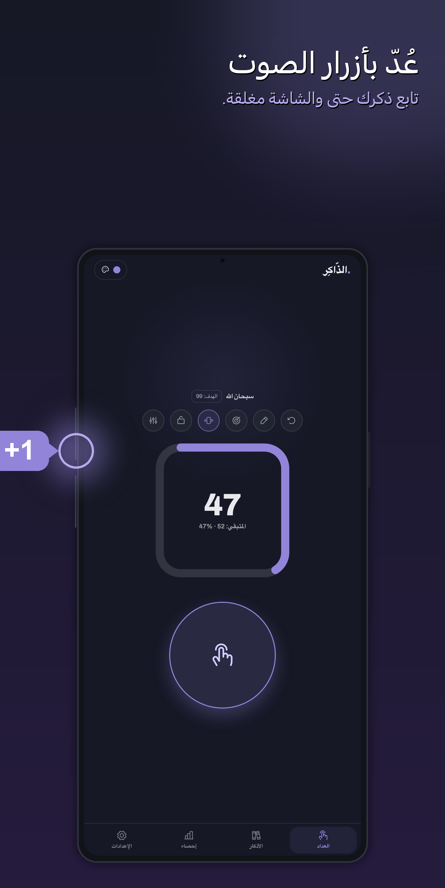
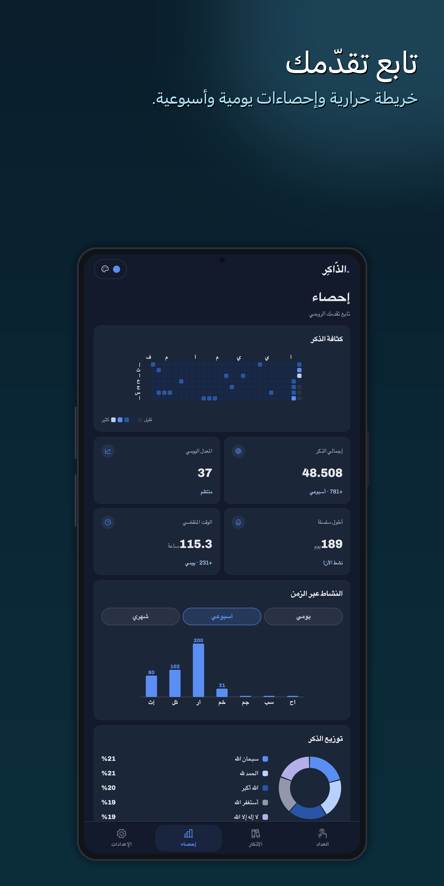
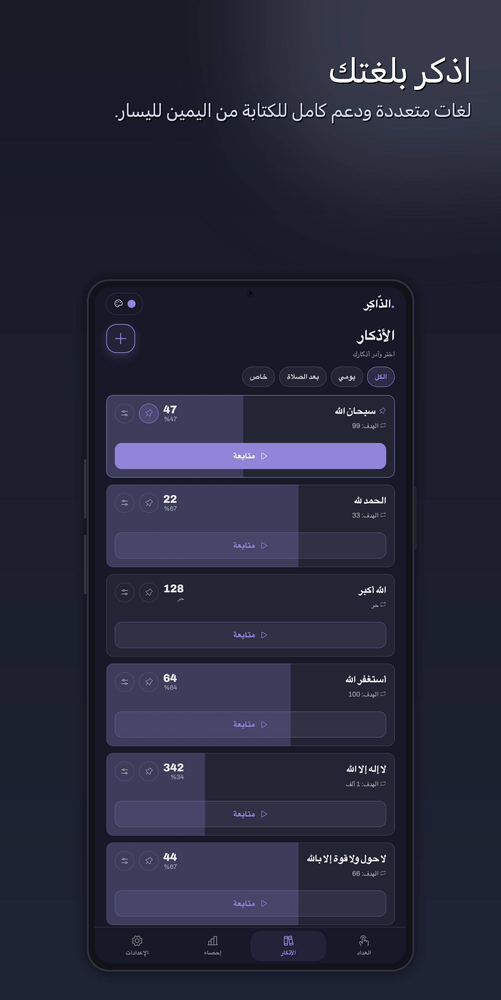

# Zikirci · Dhikrer

[English](README.md) · [Türkçe](README.tr.md) · **العربية**

**عدّاد ذِكر** حديث وخالٍ من التشتيت لنظام Android.
عُدَّ بزر لمس كبير، أو **بأزرار الصوت** — حتى والشاشة مطفأة — أو عبر **أداة على الشاشة الرئيسية**.
أنيق وسريع وقابل للتخصيص بالكامل.

  
  
  
  
  
  

معرّف التطبيق `com.fxerkan.dhikrer` — يُسمّى **Zikirci** بالتركية و**Dhikrer** بالإنجليزية.

## لماذا يختلف Zikirci

- 🚫 **لا إعلانات. أبدًا.** ولا حتى لافتة واحدة أو إعلان بيني أو "شاهد لتفتح".
- 💛 **مجاني.** بلا جدران دفع أو اشتراكات أو ميزات مقفلة.
- 🔒 **لا معلومات شخصية.** لا حساب، لا تسجيل، لا بريد — فقط افتح وابدأ العدّ.
- 📡 **لا تتبّع ولا قياس عن بُعد.** لا يُجمع أي شيء ولا يُرسل إلى أي مكان. كل عدّ وإعداد
  وإحصائية يبقى **على جهازك فقط** (يعمل دون اتصال أولًا، وبلا شبكة).
- 🧭 **لا أذونات مفاجئة.** لا موقع ولا جهات اتصال ولا كاميرا ولا تطفّل على التخزين.

## الميزات

- **عدّاد** من 0 إلى 999 مع مؤشّر «الآلاف» (1 ألف، 2 ألف …)، تصاعديًا **أو** تنازليًا، ويكمل
  تمامًا من حيث توقّفت.
- **عُدَّ في أي مكان:** زر لمس كبير، **أزرار الصوت (والشاشة مطفأة)**، أو **أداة** قابلة لتغيير الحجم
  على الشاشة الرئيسية.
- **ثلاثة تصاميم للعدّاد:** حلقة كلاسيكية، وزر **موحّد** عملاق، وحلقة **مِسبحة** تمتلئ مع العدّ،
  مع خرزات فاصلة عند 33 / 66 / 99.
- **المحطّات:** اهتزاز + صوت عند 33 و66 و99 و100 و999 و1000 — كلٌّ منها قابل للتفعيل على حدة.
- **أذكاري:** احفظ أذكارًا بلا حدّ، صوت واهتزاز لكل ذِكر، تثبيت، إعادة ترتيب، حذف بالسحب.
- **التذكيرات:** إشعارات يومية في الأوقات التي تختارها.
- **الإحصائيات:** خريطة حرارية بنمط git، وسلاسل متتابعة، واتجاهات يومية/أسبوعية/شهرية، وحلقة
  توزيع — كلها من سجلّ عدّك **الحقيقي**، على الجهاز.
- **10 سمات** (داكنة وفاتحة)، **6 لغات** (TR، EN، AR بما فيها RTL، ID، HI، ZH)، ووضع **قفل**
  (يستجيب العدّاد وحده)، وتخصيص كامل للزر (الحجم/الشكل/اللون/الموضع)، ومؤثّرات حركية
  (حلقة / موجة / امتلاء / تحوّل الشكل).
- **متاح وسريع الاستجابة:** عدّاد وزر كبيران وعاليا التباين؛ يتكيّف مع الهواتف الصغيرة والكبيرة
  والأجهزة اللوحية؛ حافة‑إلى‑حافة على Android الحديث.

## التوافق

يعمل على **Android 8.0+ (API 26)** — تم اختبار ودعم Android **12 و13 و14 و15 و16**.

الإصدار الحالي: **1.2.3** (versionCode 11). السجل الكامل في
[`CHANGELOG.md`](CHANGELOG.md) (بالإنجليزية) · [`CHANGELOG.tr.md`](CHANGELOG.tr.md) (بالتركية).

## خارطة الطريق

مُخطّط لإصدارات قادمة:

- 🌍 **واجهة عربية كاملة (RTL)** — إتمام التعريب من اليمين إلى اليسار والتحقّق منه وتفعيله في مُنتقي اللغة.
- 🎧 **تكامل سمّاعات Bluetooth** — العدّ والتحكّم بأزرار سمّاعات Bluetooth.
- 🔊 **نطق الذِكر صوتيًا** — تلاوة الذِكر النشط صوتيًا أثناء العدّ.
- 📊 **أداة إحصائيات** — أداة على الشاشة الرئيسية تعرض عدّك اليومي وسلسلتك وتقدّمك.
- 📤 **مشاركة الذِكر** — شارك أذكارك وتقدّمك مع الآخرين.

## المطوّر

طوّره [@FXerkan](https://fxerkan.com) — Code more, worry less.
