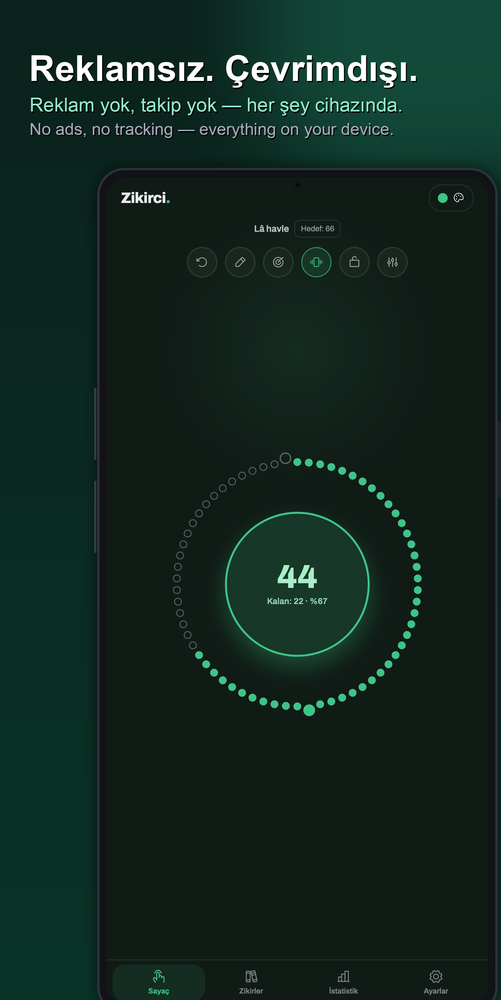
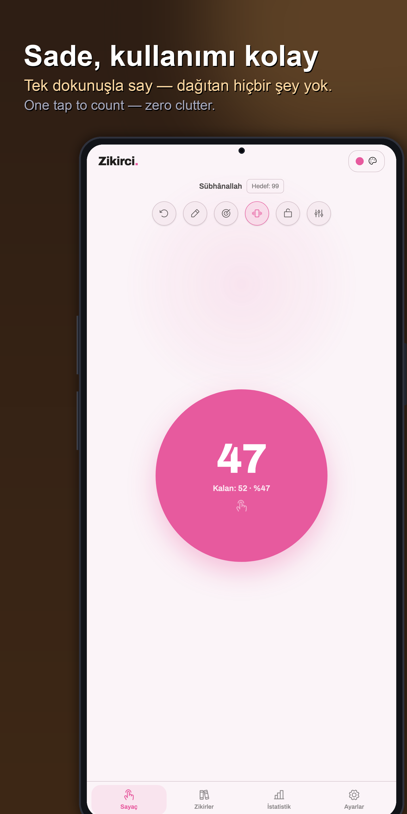
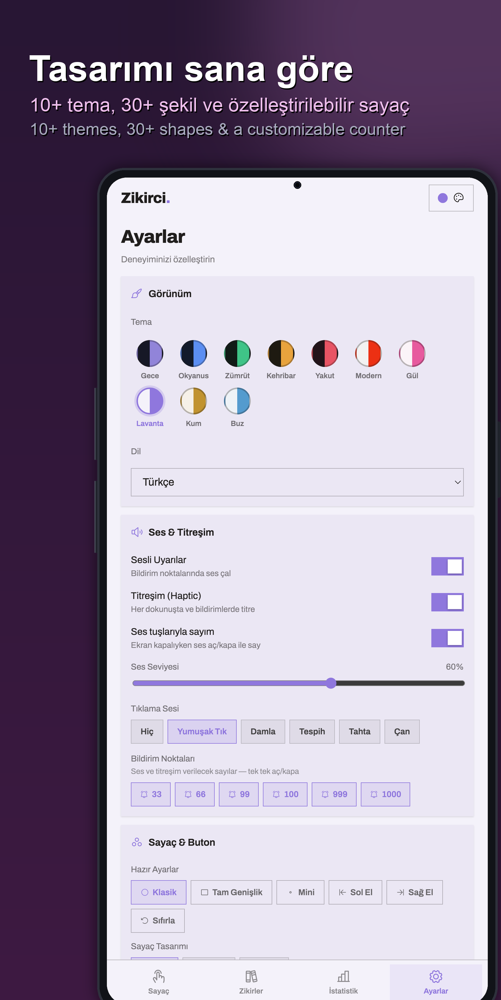
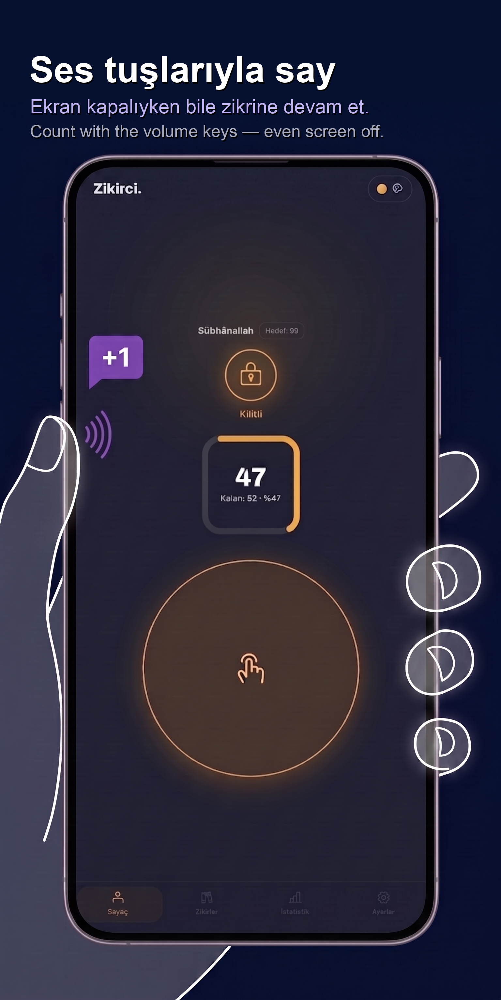
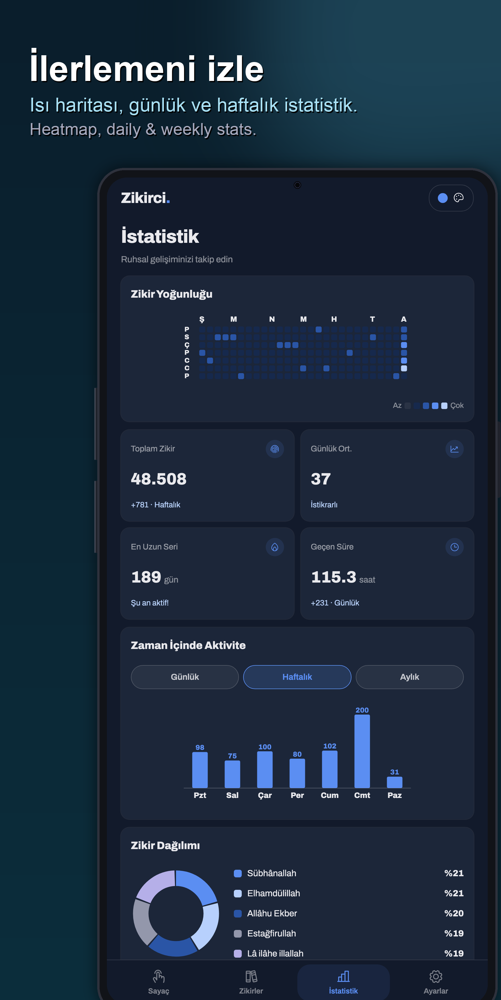
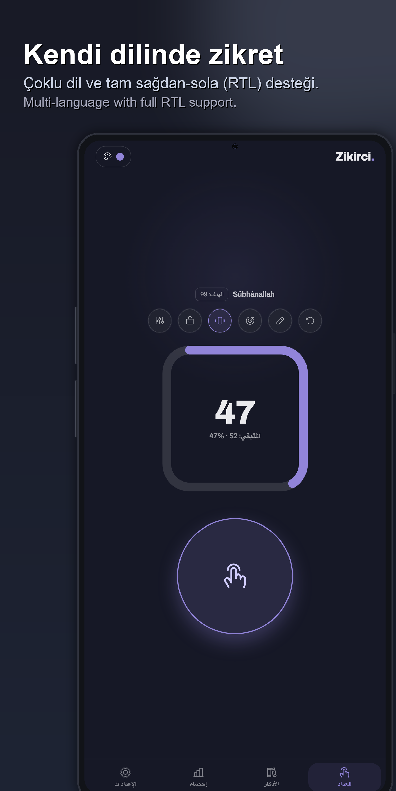

# Zikirci · Dhikrer

[English](README.md) · **Türkçe** · [العربية](README.ar.md)

Android için modern, dikkat dağıtmayan bir **zikir (dhikr) sayacı**.
Büyük bir dokunma butonu, **ses tuşları** — ekran kapalıyken bile — veya bir **ana ekran widget'ı** ile say.
Şık, hızlı ve tümüyle özelleştirilebilir.

  
  
  
  
  
  

Uygulama kimliği `com.fxerkan.dhikrer` — Türkçede **Zikirci**, İngilizcede **Dhikrer**.

## Zikirci neden farklı

- 🚫 **Reklam yok. Asla.** Tek bir banner, geçiş reklamı veya "izleyerek aç" yok.
- 💛 **Ücretsiz.** Paywall, abonelik veya kilitli özellik yok.
- 🔒 **Kişisel bilgi yok.** Hesap yok, kayıt yok, e‑posta yok — aç ve saymaya başla.
- 📡 **Telemetri yok, takip yok.** Hiçbir şey toplanmaz veya bir yere gönderilmez. Her sayım,
  ayar ve istatistik **yalnızca cihazında** yaşar (önce çevrimdışı, ağ olmadan çalışır).
- 🧭 **Sürpriz izin yok.** Konum, rehber, kamera veya depolama karıştırması yok.

## Özellikler

- **Sayaç** 0–999, "bin" göstergesiyle (1 bin, 2 bin …); yukarı **veya** aşağı sayım; tam olarak
  kaldığın yerden devam eder.
- **Her yerde say:** büyük dokunma butonu, **ses tuşları (ekran kapalı)** veya yeniden boyutlanabilen
  **ana ekran widget'ı**.
- **Üç sayaç tasarımı:** Klasik halka, **Birleşik** dev buton ve saydıkça dolan, 33 / 66 / 99 ayraç
  boncuklu bir **Tesbih** halkası.
- **Kilometre taşları:** 33, 66, 99, 100, 999, 1000'de titreşim + ses — her biri ayrı açılıp kapatılabilir.
- **Zikirlerim:** sınırsız zikir kaydet, zikir başına ses & titreşim, sabitle, sırala, kaydırarak sil.
- **Hatırlatıcılar:** seçtiğin saatlerde günlük bildirimler.
- **İstatistik:** git tarzı yoğunluk ısı haritası, seriler, günlük/haftalık/aylık eğilimler ve bir
  dağılım halkası — hepsi **gerçek** sayım geçmişinden, cihazda.
- **10 tema** (koyu & açık), **6 dil** (TR, EN, AR — RTL dahil, ID, HI, ZH), bir **Kilit** modu
  (yalnızca sayaç yanıt verir), tam buton özelleştirmesi (boyut/şekil/renk/konum) ve animasyon
  efektleri (halka / dalga / dolum / şekil‑morph).
- **Erişilebilir & duyarlı:** büyük, yüksek kontrastlı sayaç ve buton; küçük telefonlara, büyük
  telefonlara ve tabletlere uyum sağlar; modern Android'de edge‑to‑edge.

## Uyumluluk

**Android 8.0+ (API 26)** üzerinde çalışır — Android **12, 13, 14, 15, 16** test edildi ve desteklenir.

Güncel sürüm: **1.2.3** (versionCode 11). Tüm geçmiş
[`CHANGELOG.tr.md`](CHANGELOG.tr.md) (Türkçe) · [`CHANGELOG.md`](CHANGELOG.md) (English) dosyalarında.

## Yol haritası

İleriki sürümler için planlananlar:

- 🎧 **Bluetooth kulaklık entegrasyonu** — Bluetooth kulaklık tuşlarıyla say ve kontrol et.
- 🔊 **Zikir seslendirme** — saydıkça aktif zikrin sesli okunması.
- 📊 **İstatistik widget'ı** — günlük sayım, seri ve ilerlemeyi gösteren ana ekran widget'ı.
- 📤 **Zikir paylaşma** — zikirlerini ve ilerlemeni başkalarıyla paylaş.

## Geliştirici

[@FXerkan](https://fxerkan.com) tarafından geliştirildi — Code more, worry less.
